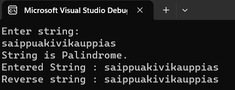
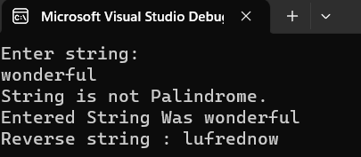

## Palindrome


## Aim:
To write a C# program to find whether the given string is a Palindrome or not.
## Algorithm:
## Step 1:
Create a new Class.

## Step 2:
Get input from the user and store it.

## Step 3:
Loop over the entire string and reverse it.

## Step 4:
Use if condition to check whether the string and the reversed string is equal or not.

## Step 5:
print palindrome if it's equal else print not a palindrome.

## Step 6:
Print the input and reversed string along with the whether palindrom or not.

## Step 7:
End of the Program.


## Program:
```
using System;
namespace palindrome
{
    class Program
    {
        static void Main(string[] args)
        {
            string s, revs = "";
            Console.WriteLine("Enter string:");
            s = Console.ReadLine();
            for (int i = s.Length - 1; i >= 0; i--)  
            {
                revs += s[i].ToString();
            }
            if (revs == s) 
            {
                Console.WriteLine("String is Palindrome.\nEntered String : {0}\nReverse string : {1}", s, revs);
            }
            else
            {
                Console.WriteLine("String is not Palindrome.\nEntered String Was {0}\nReverse string : {1}", s, revs);
            }
            
        }
    }
}
```

## Output:



## Result:
   Thus the C# program to display whether the given string is Palindrome or not is executed successfully.
